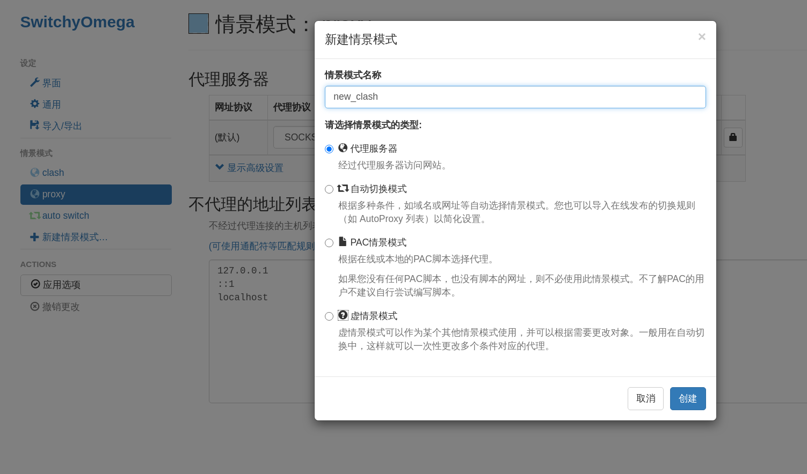
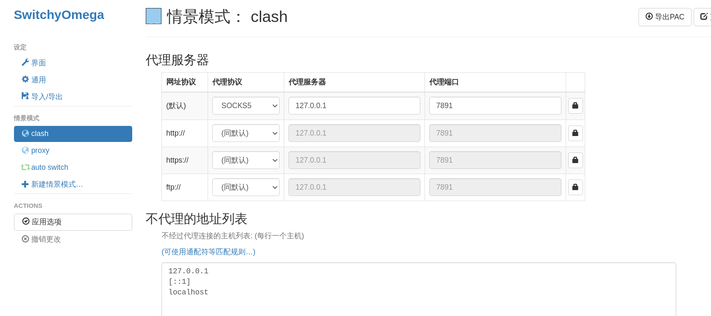
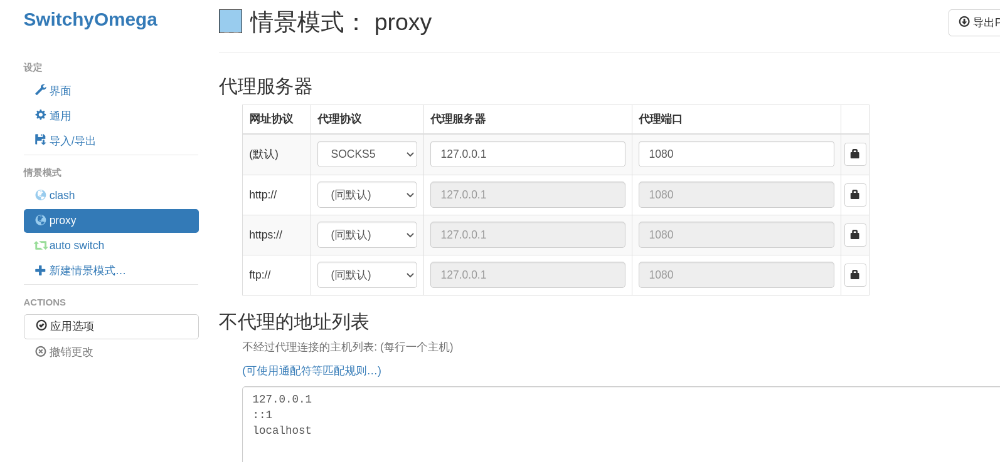

# Clash使用指南

## 一、安装Clash

```shell
yay clash
# or sudo pacman -S clash
```


## 二、`config.yml`与`Country.mmdb`

`config.yml`一般是机场会给的一系列节点的相关信息的文件。

`Country.mmdb`是全球IP库，可以实现各个国家的IP信息解析和地理定位，为了以后使用方便，`Country.mmdb`文件就直接放在项目里，不放心的话，Github上就有，链接地址如下：[Country.mmdb 地址](https://github.com/Dreamacro/maxmind-geoip/releases/latest/download/Country.mmdb)。

这两个文件是Clash使用必不可少的文件，通常我会根据不同的机场名字在`~/.config/clash`下建立不同的文件夹，每个文件夹里都有这两个文件。

此外，如果是KDE/XFCE桌面的话，要在`~/.bashrc`中添加如下内容：

```
export http_proxy="http://127.0.0.1:7890"
export https_proxy="http://127.0.0.1:7890"
export all_proxy="http://127.0.0.1:7890"
export HTTP_PROXY="http://127.0.0.1:7890"
export HTTPS_PROXY="http://127.0.0.1:7890"
export ALL_PROXY="http://127.0.0.1:7890"
```

> Gnome不需要，因为可以手动设置。。。

因为一般机场的Clash配置yml文件中会设置HTTP代理端口为7890，SOCKS端口为7891。

要使用对某家机场的节点，比方说`N3RO`，`clash -d ~/.config/clash/N3RO`，clash就跑起来了。


###  三、Linux下Clash的Web UI—Clash Dashboard

在Clash运行起来之后，通过浏览器访问`http://clash.razord.top/`，就可以进入Clash Dashboard，在这里可以选择代理，进行Clash的相关设置：选择代理节点，代理模式等。

> 如果使用的机场不会进行在线Clash节点更新的话，最好隔几天就用新的yml文件覆盖旧的yml文件。


## 四、Chrome下SwitchyOmega安装与Clash代理配置

通过Firefox去[SwitchyOmega 的 github 仓库](https://github.com/FelisCatus/SwitchyOmega/releases)下载`SwitchyOmega_Chromium.crx`，下载完成后将`SwitchyOmega_Chromium.crx`后缀名改为`zip`，即`SwitchyOmega_Chromium.zip`(**不用压缩！！！只是改后缀名！！！**)，在`chrome://extensions`页面托入改过后缀名的文件`SwitchyOmega_Chromium.zip`，完成。

之后进入``SwitchyOmega`的选项界面，选择新建情景模式，输入自定义的情景模式名称之后，选择最上面的代理服务器，点击创建。



创建好之后，将默认的代理协议改成`SOCKS_5`，代理服务器为`127.0.0.1`，端口为7891(yml文件中配置的`SOCKS_5`对应端口)，之后点击“应用选项”即可。



至此，就算完成了。


## 五、Firefox下SwitchyOmega安装与Clash代理配置

去Firefox中[SwitchyOmega的下载地址](https://addons.mozilla.org/en-US/firefox/addon/switchyomega/)选择`Add to Firefox`即可，会自动安装到Firefox中。后面的操作和Chrome下一模一样。


## 六、安装`electron-ssr`作为保险

```shell
yay electron-ssr
```

之后在Chrome，Firefox中SwitchyOmega里将proxy情景模式作如下修改：

默认的代理协议`SOCKS_5`，代理服务器`127.0.0.1`，代理端口1080(因为`electron-ssr`默认本地监听端口为1080)。



这样子就可以使用`electron-ssr`了，作为clash的保险。

